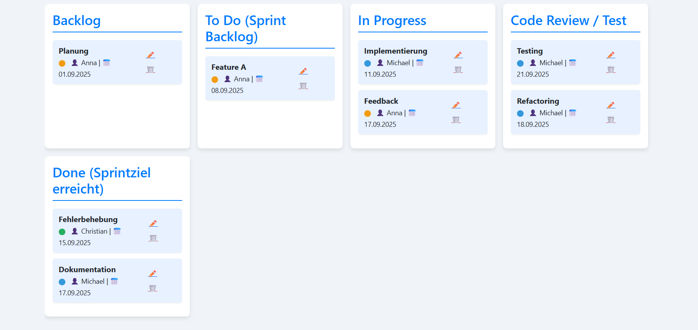

# 🗂️ Scrum Kanban Board

Ein interaktives **Scrum-Kanban-Board** für effizientes Aufgabenmanagement in agilen Softwareprojekten.  
Dieses Projekt wurde mit **HTML**, **CSS**, **JavaScript** und **Vue.js** entwickelt und bietet ein benutzerfreundliches Interface zur Verwaltung von **Nutzern**, **Rollen** und **Aufgaben**.



---

## 🚀 Features

### 👥 Nutzerverwaltung
- **Teammitglieder hinzufügen** inkl. Namen & Rollen
- Rollen: `Product Owner`, `Entwickler`, `Scrum Master`
- Bearbeiten oder Löschen von Nutzern
- Automatische **Farbkennzeichnung** pro Rolle

### ✅ Aufgabenmanagement
- Aufgaben hinzufügen mit:
  - Titel / Beschreibung
  - Verantwortlichem Nutzer
  - Deadline
- Aufgaben bearbeiten oder löschen
- Aufgabenstatus ändern via **Drag & Drop**

### 🏷️ Statusspalten
- **Backlog** – Ideen und noch nicht geplante Aufgaben
- **To Do** – Aufgaben im Sprint Backlog
- **In Progress** – aktuell in Bearbeitung
- **Code Review / Test** – Aufgaben in der Prüfung
- **Done** – abgeschlossene Aufgaben

### 💾 Lokale Speicherung
- **LocalStorage**-Integration: Alle Daten (Nutzer & Aufgaben) bleiben auch nach dem Neuladen erhalten.

---

## 🛠️ Technologien

- **HTML5** – Struktur und Markup
- **CSS3** (inkl. Responsive Design & Bootstrap 5)
- **JavaScript** (Vanilla + **Vue 3**)
- **LocalStorage API** zur Datenspeicherung

---

## 📦 Installation & Nutzung

### 1. Projekt klonen
```bash
git clone https://github.com/<DEIN_USERNAME>/<REPO_NAME>.git
cd <REPO_NAME>
